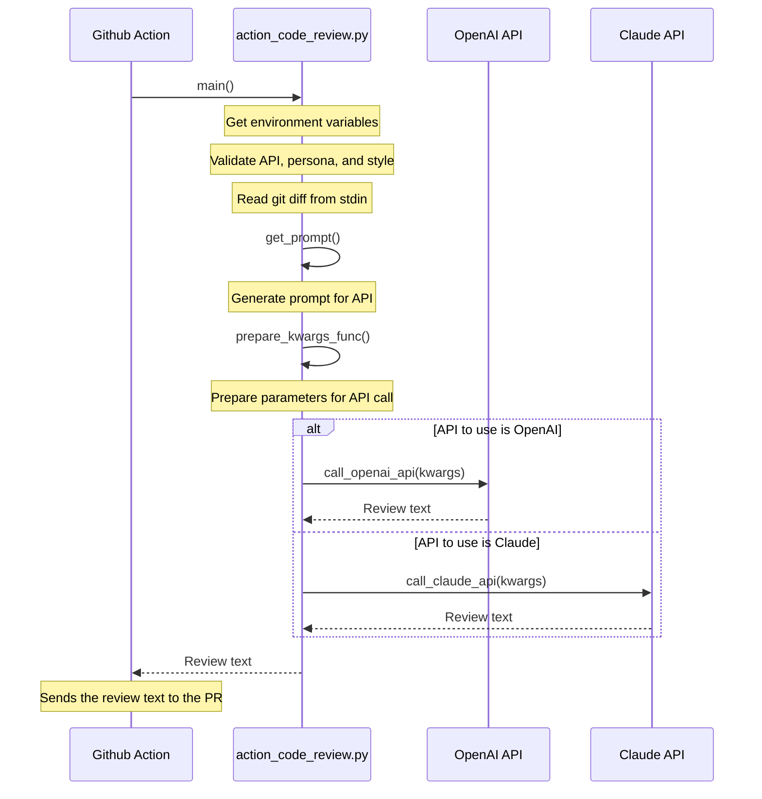

```mermaid
sequenceDiagram
    participant GithubAction as Github Action
    participant action_code_review as action_code_review.py
    participant OpenAI_API as OpenAI API
    participant Claude_API as Claude API
    GithubAction->>action_code_review: main()
    Note over action_code_review: Get environment variables
    Note over action_code_review: Validate API, persona, and style
    Note over action_code_review: Read git diff from stdin
    action_code_review->>action_code_review: get_prompt()
    Note over action_code_review: Generate prompt for API
    action_code_review->>action_code_review: prepare_kwargs_func()
    Note over action_code_review: Prepare parameters for API call
    alt API to use is OpenAI
        action_code_review->>OpenAI_API: call_openai_api(kwargs)
        OpenAI_API-->>action_code_review: Review text
    else API to use is Claude
        action_code_review->>Claude_API: call_claude_api(kwargs)
        Claude_API-->>action_code_review: Review text
    end
    action_code_review-->>GithubAction: Review text
    Note over GithubAction: Sends the review text to the PR

```